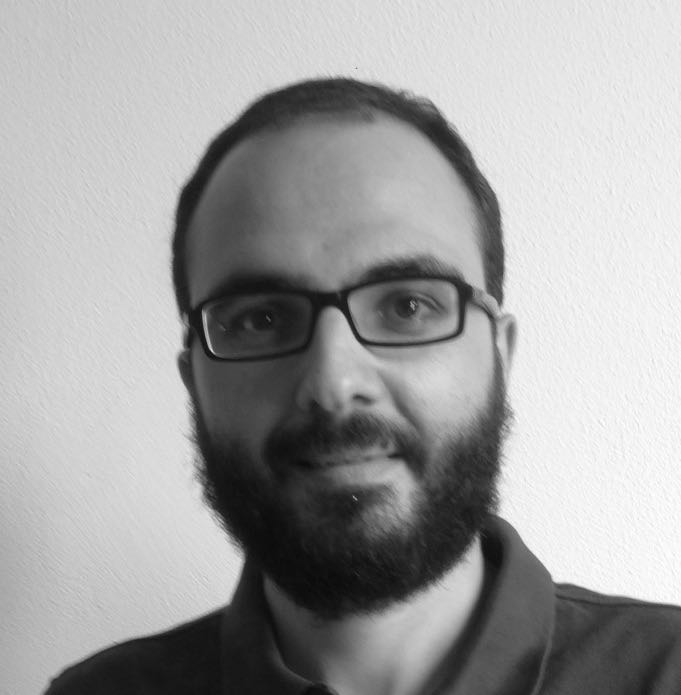

Welcome to my website! I'm a political scientist specializing in political behavior, public opinion and methodology.

Currently, I’m a Max Weber Fellow working at the [Department of Political and Social Sciences](https://www.eui.eu/DepartmentsAndCentres/PoliticalAndSocialSciences) of the [European University Institute](https://www.eui.eu/), Fiesole. I was previously a post-doctoral researcher at the [Institute of Humanities and Social Sciences](http://www.sns.it/istituto-di-scienze-umane-e-sociali) of the Scuola Normale Superiore (SNS), in Florence, and at the [Department of Political Science]("http://scienzepolitiche.luiss.it/en) of LUISS University, Rome. I'm also a member of the [Centre on Social Movements Studies](http://cosmos.sns.it) at SNS and a research affiliate of the [Italian Institute for Public Policy Analysis](http://www.inapp.org), in Rome.

I got a PhD in Political Science in 2013 from the Istituto Italiano di Scienze Umane, in Florence, and I previously studied Methodology and Empirical Research for the Social Sciences (MA, Università di Firenze) and Sociology (BA, Università di Trento). I was visiting fellow at the Center for the Study of Democracy, University of California (USA), and at the Department of Sociology, Universiteit Utrecht (NL).
